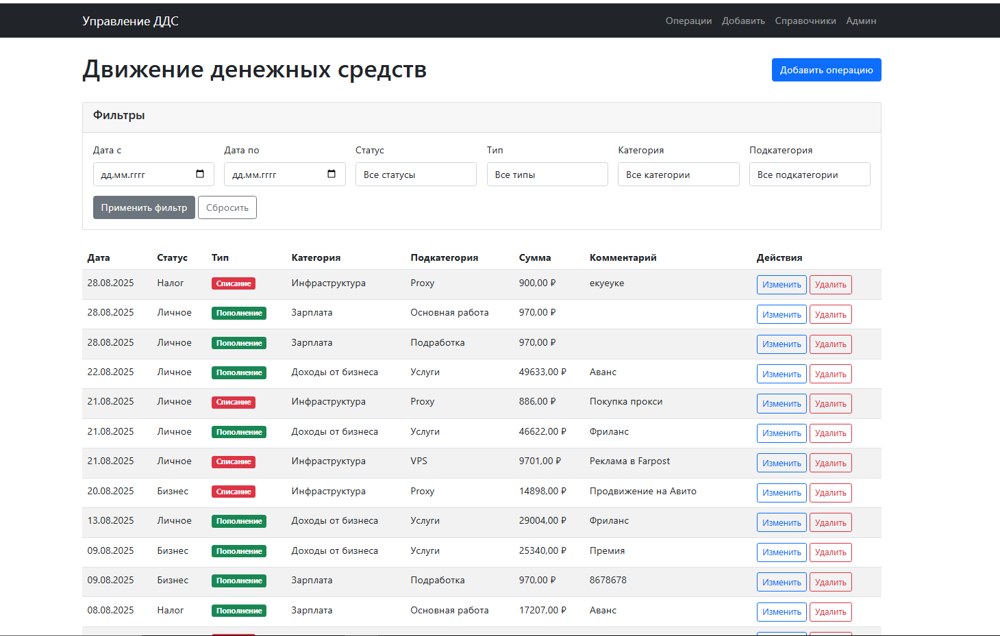
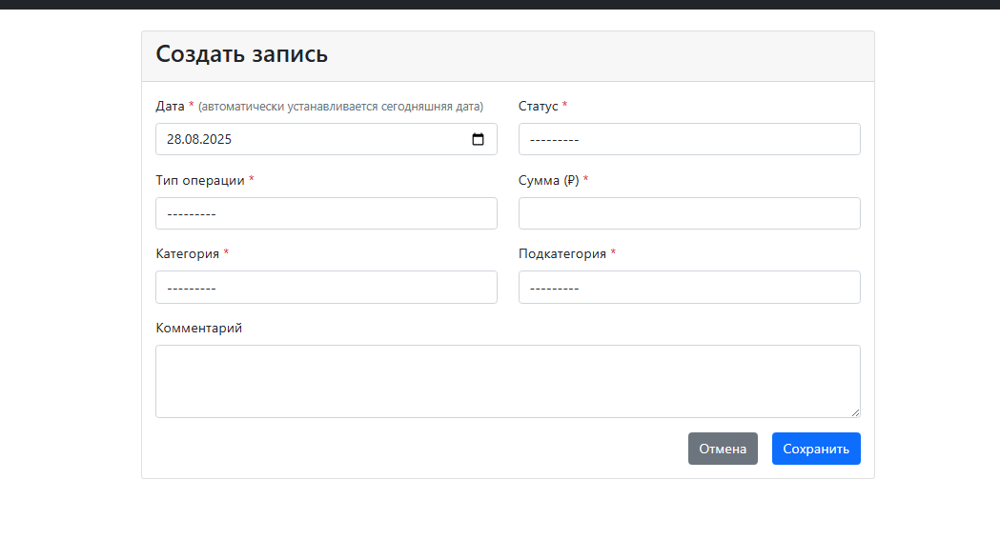
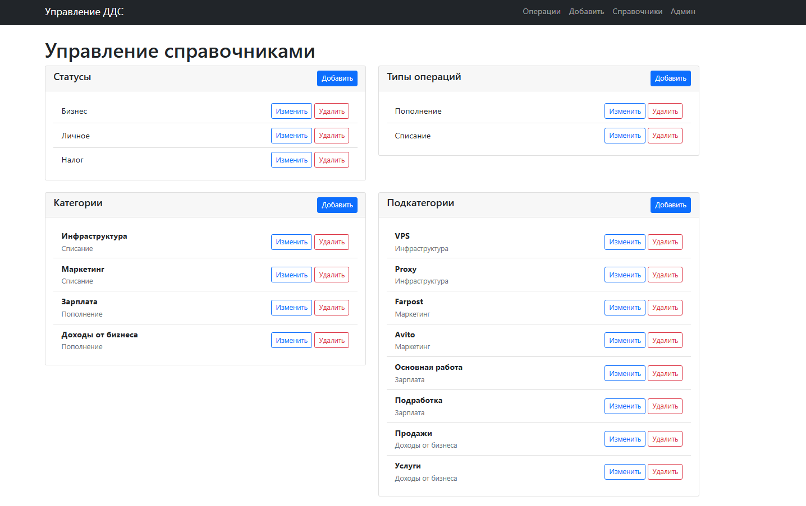
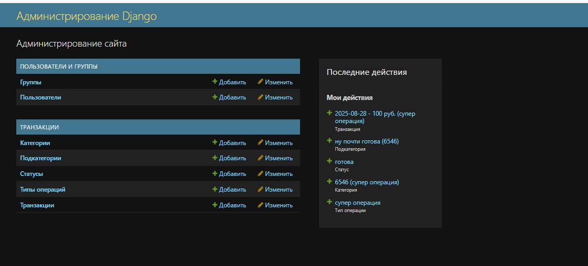

# Настройка Проекта
## Клонируем репозиторий
```
git clone <https://github.com/1KELER1/DDS>
```
Переходим в папку проекта
```
cd DDS
```
## Создание виртуального окружения
```
python -m venv venv
```
## Активация виртуального окружения
### Windows:
```
venv\Scripts\activate
```
### Linux/Mac:
```
source venv/bin/activate
```

# Установка зависимостей
```
pip install -r requirements.txt
```


### Создание миграций
```
python manage.py makemigrations
```
### Применение миграций
```
python manage.py migrate
```

### Создание суперпользователя
```
python manage.py createsuperuser
```

## загрузка нужных полей
```
python manage.py load_initial_data
```

## загрузка тестовых данных(Опционально)
```
python manage.py load_test_transactions
```

# запуск проекта
```
python manage.py runserver 
```

проект запущен локально на порту 8000
```
http://127.0.0.1:8000/
```
# Скриншоты проекта







